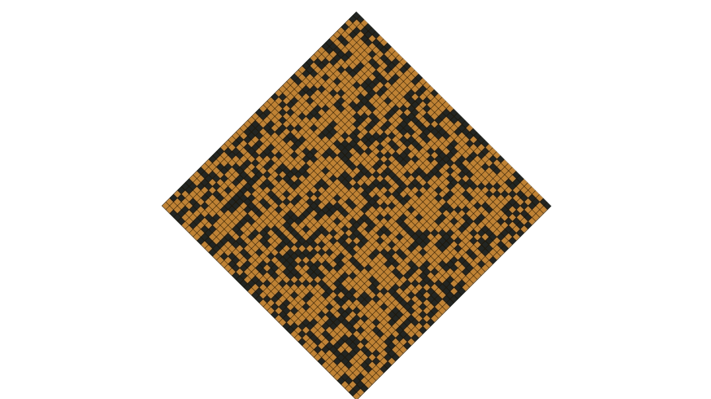
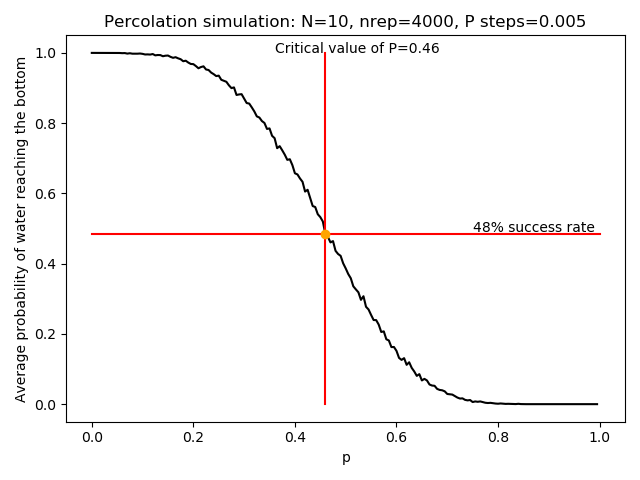

 # Percolation 
In this project, I am modeling percolation in Python.

The project uses `Tkinter` for animation graphics and `matplotlib` for graphs.

To view the code, visit [`percolation.py`](percolation.py)

This specific algorithm was designed to simulate water flowing through rocks and sand, but could be modified to simulate forest fires or other applications of percolation.

After running many simulations, it is possible to graph trends and average out what proportion of rock:sand is required to get a 50/50 chance of the water droplet making it to the bottom. 

